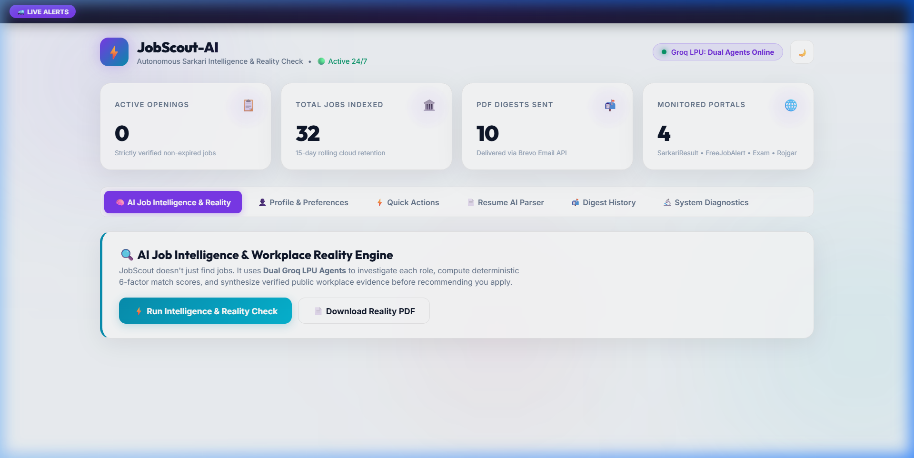
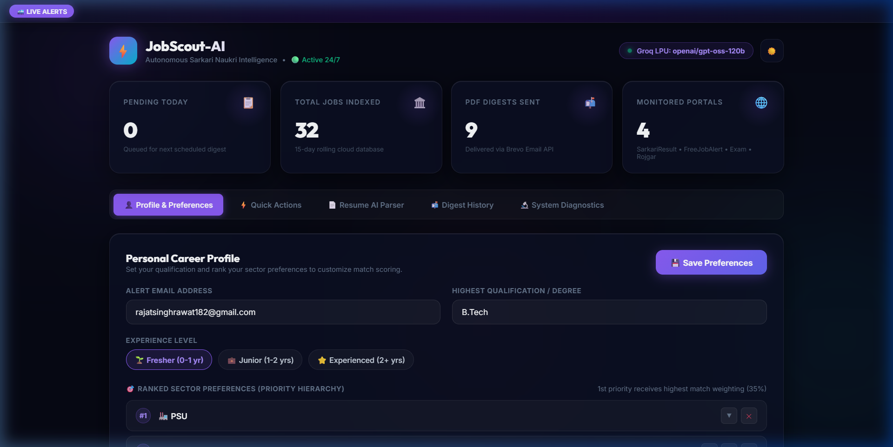
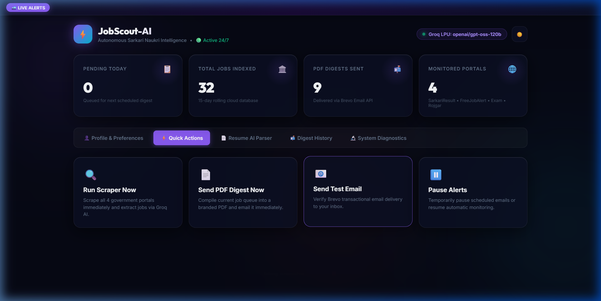
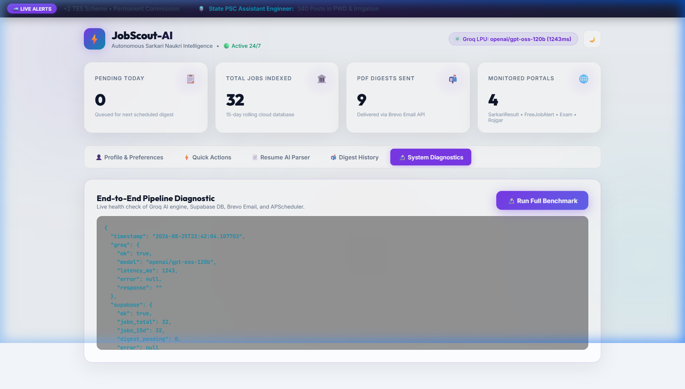
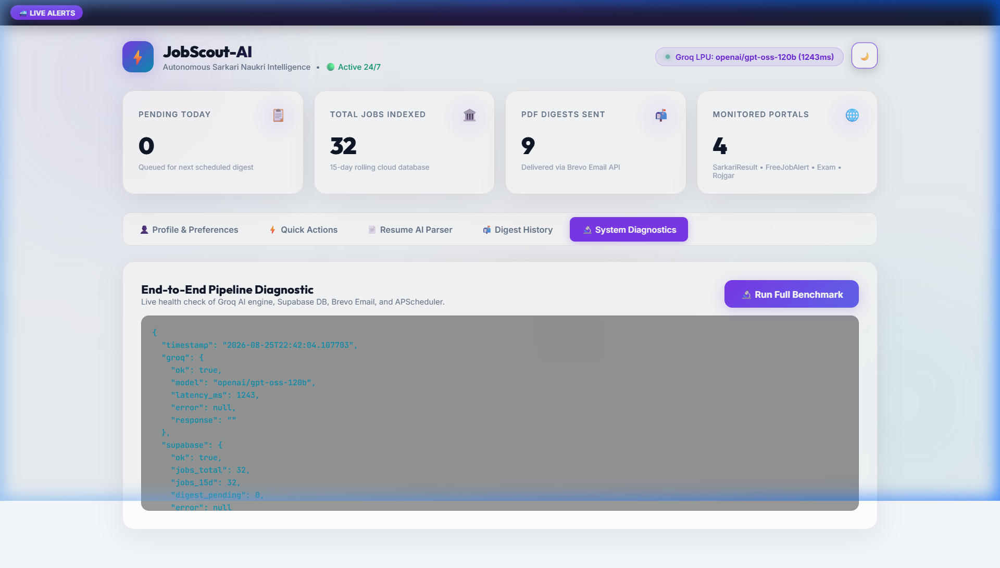
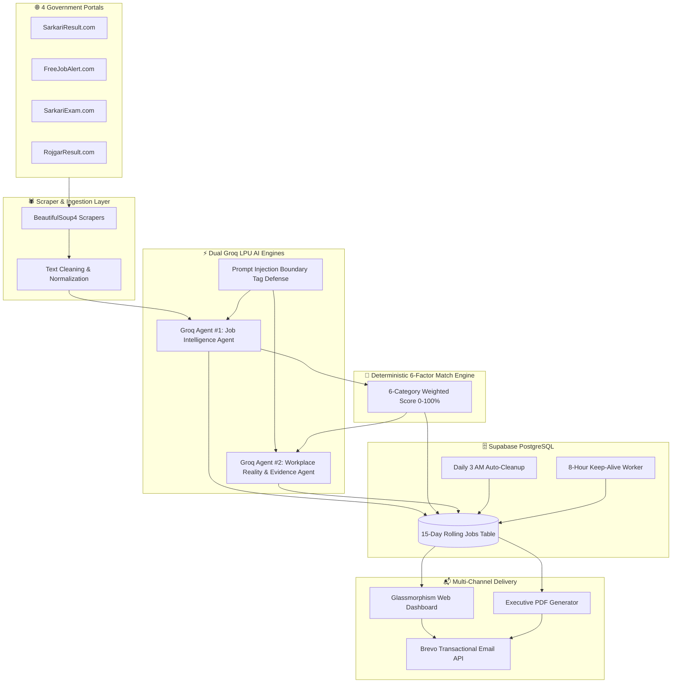

<p align="center">
  
</p>

<h1 align="center">⚡ JobScout-AI v2.2</h1>

<p align="center">
  <strong>Autonomous Government Job Intelligence & Workplace Reality Engine powered by Dual Groq LPU™ AI</strong>
</p>

<p align="center">
  <em>Continuous multi-source web scraping, dual-agent LLM analysis, deterministic 6-factor matching, evidence-based workplace reality checks, and executive PDF reports delivered directly to your inbox — 100% Free-Tier ($0/month).</em>
</p>

<p align="center">
  
  
  
  
  
  
  
  
</p>

---

## 📸 Dashboard Preview & Visual Showcase

### 1. 🧠 AI Job Intelligence & Workplace Reality Command Center
> Interactive intelligence cards featuring Dual Score Badges (`🎯 95% Match` & `🏛️ Reality: 82/100`), Recommendation tags (`🌟 STRONG APPLY`), positive workplace signals, and deep inspection modal.



### 2. ⚡ Ultra-Premium Glassmorphism Command Center & Running Train Ticker
> Real-time streaming Sarkari alerts train marquee, 4 KPI counters, profile management, and interactive ranked sector preference hierarchy.



### 3. ⚡ Quick Actions & Manual Control Panel
> Instant on-demand scraper triggers, immediate PDF digest delivery, Brevo test email dispatches, and notification toggle.



### 4. 🔬 Live System Diagnostics & Dual Groq Benchmark
> Real-time latency benchmark (~1.1s inference time), Supabase 15-day rolling storage health, and APScheduler background tasks monitor.



### 5. ☀️ Dynamic Theme Switching (Light Glassmorphism Mode)
> Crystal-clear responsive interface supporting one-click toggling between Dark Neon Indigo and Light Ice Blue themes.



---

## 🌟 Key Highlights & Innovations

### 🧠 Dual Groq LPU™ AI Agents
- **Groq Agent #1 (Job Intelligence Agent):** Analyzes scraped job postings with prompt injection defense, extracting structured requirements, skill prereqs, exam criteria, and compensation.
- **Groq Agent #2 (Job Reality Research Agent):** Investigates public workplace sentiment, work-life balance, management culture, and interview difficulty for target departments.

### 🎯 Deterministic 6-Factor Match Engine
- 100% explainable mathematical scoring (Skills 35%, Experience 20%, Sector Priority 20%, Location 10%, Salary 10%, Work Mode 5%).
- Actionable recommendations: `🌟 STRONG APPLY`, `✅ APPLY`, `🔍 INVESTIGATE`, `📌 CONSIDER`, `✕ SKIP`.

### ⏳ Strict Expired Job Filtering
- Completely excludes past-deadline jobs (`last_date < date.today()`) from matching, digest emails, PDFs, and candidate queues.

### 🚄 Animated Running Train Ticker
- High-velocity marquee element gliding smoothly from right to left showcasing live breaking notifications across UPSC, SSC, RRB, Banking, Defence, and State PSCs.

### 📄 Executive-Grade PDF Reports
- Built with ReportLab to generate rich, branded A4 documents.
- Includes high-stat executive summary, Top-Right Match Score Badge (`🎯 96% Match`), Nature of Work / Job Summary, Form Fees, Age Limits, Selection Process, and Dual Action Links (Official Notification PDF & Direct Application Portal).

### 🗑️ 15-Day Auto-Retention & Keep-Alive
- Database retention strictly set to **15 days** to guarantee Supabase Free Tier never fills up.
- Automatic daily 3:00 AM IST cleanup and 8-hour keep-alive ping prevents project pausing.

---

## 🏗️ System Architecture & Data Flow



---

## 🚀 Quick Start & Local Setup

### 1. Clone & Install Dependencies
```bash
git clone https://github.com/rajat9para/JobScout-AI.git
cd JobScout-AI
python -m venv venv
venv\Scripts\activate   # Windows
# source venv/bin/activate  # Linux/macOS
pip install -r requirements.txt
```

### 2. Configure Environment Variables
Copy `.env.example` to `.env` and provide your credentials:
```env
SUPABASE_URL=https://your-project.supabase.co
SUPABASE_KEY=your_supabase_anon_key
SUPABASE_SERVICE_KEY=your_supabase_service_role_key

BREVO_API_KEY=xkeysib-your-brevo-api-key
SENDER_EMAIL=your.verified.email@gmail.com
USER_EMAIL=your.alert.recipient@gmail.com

GROQ_API_KEY=gsk_your_primary_groq_key
GROQ_JOB_INTELLIGENCE_API_KEY=gsk_your_primary_groq_key
GROQ_JOB_REALITY_API_KEY=gsk_your_reality_research_groq_key
GROQ_MODEL=openai/gpt-oss-20b
JOB_REALITY_RESEARCH_LIMIT=10
```

### 3. Run Automated 10-Subsystem Verification Suite
```bash
python tests/test_full_pipeline.py
```

### 4. Start the Application
```bash
python -m uvicorn app.main:app --reload --port 8000
```
Open **http://127.0.0.1:8000** to access the Web Dashboard.

---

## 🛠️ REST API Reference

| Method | Endpoint | Description |
|---|---|---|
| `POST` | `/api/intelligence/run` | Run full AI Job Intelligence & Reality Check on active jobs |
| `GET` | `/api/intelligence/jobs` | Retrieve analyzed jobs with dual Match & Reality scores |
| `GET` | `/api/intelligence/job/{job_id}` | Get detailed intelligence & evidence analysis for a specific job |
| `POST` | `/api/intelligence/job/{job_id}/refresh` | Re-run fresh reality check research on a specific job |
| `GET` | `/api/intelligence/download-pdf` | Generate and download specialized AI Reality Report PDF |
| `GET` | `/api/intelligence/config` | Retrieve masked status of AI Provider API keys |
| `POST` | `/api/trigger-scrape` | Trigger immediate scrape across all 4 portals |
| `POST` | `/api/trigger-digest` | Generate and email executive PDF digest immediately |
| `GET` | `/api/debug` | End-to-end system diagnostics & latency benchmark |

---

## 📄 License
MIT License © 2026 JobScout-AI Team.
