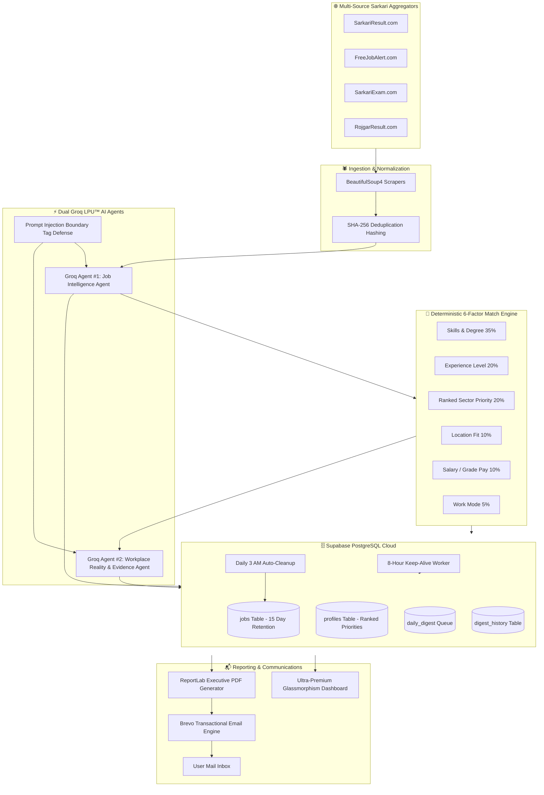

# JobScout v2.2 — Full Architecture & Engineering Specification

> **Project:** Autonomous Sarkari Naukri Intelligence & Workplace Reality Platform  
> **Version:** 2.2.0 (Dual Groq LPU Agents & Evidence Reality Engine)  
> **Stack:** Python 3.12, FastAPI, Dual Groq LPU AI (`openai/gpt-oss-20b` / `openai/gpt-oss-120b`), Supabase PostgreSQL, Brevo Transactional Email, ReportLab, APScheduler, Render  
> **Scope:** Multi-source government job scraping, sub-1.2s dual-agent LLM analysis, deterministic 6-factor matching, evidence-based workplace reality checks, executive PDF reporting, and 15-day rolling auto-cleanup.

---

## 1. System Architecture Overview

---

## 2. AI Job Intelligence & Reality Check Architecture

### 2.1 Groq Agent #1: Structured Job Intelligence Agent (`app/intelligence/job_analyzer.py`)
- **Key Function:** Ingests unstructured job postings and extracts clean, typed structured intelligence schemas without hallucination.
- **Prompt Injection Defense:** Wraps all scraped texts inside `<untrusted_job_content>...</untrusted_job_content>` XML boundary tags and strictly commands the model to treat content as passive text data.
- **Output Schema:**
  - `job_title`, `company`, `location`, `work_mode`, `experience_required`, `seniority`
  - `salary` (structured `min`, `max`, `currency`, `raw_text`)
  - `must_have_skills` vs `nice_to_have_skills`
  - `responsibilities`, `education_requirements`, `application_fee`, `selection_process`, `last_date`

### 2.2 Deterministic 6-Factor Match Engine (`app/intelligence/match_engine.py`)
Matches candidate profiles against job requirements with 100% mathematical explainability and zero non-deterministic drift:
1. **Skills & Qualifications (35%):** Exact degree tag alignment, engineering equivalence (B.Tech ↔ B.E.), and branch matching.
2. **Experience Suitability (20%):** Fresher vs Junior vs Experienced role requirements.
3. **Sector Priority Hierarchy (20%):** User's ranked interests (#1 gets max weight, #2 gets 80%, etc.).
4. **Location Preference (10%):** State/Central jurisdiction alignment.
5. **Salary Expectations (10%):** Level-6 CPC / Grade pay suitability.
6. **Work Mode (5%):** On-site vs field vs remote duties.

**Explainable Verdicts:**
- `>= 85%`: `🌟 STRONG APPLY`
- `70% - 84%`: `✅ APPLY`
- `55% - 69%`: `🔍 INVESTIGATE`
- `40% - 54%`: `📌 CONSIDER`
- `< 40%`: `✕ SKIP`

### 2.3 Groq Agent #2: Job Reality Research & Evidence Engine (`app/intelligence/reality_researcher.py`)
- **Key Function:** Investigates public employee sentiment, work-life balance realities, department culture, and interview difficulty for the target organization.
- **Evidence-Based Metrics (/5.0 Scale):**
  - **Employee Sentiment** (e.g. 3.8/5.0)
  - **Work-Life Balance** (e.g. 4.1/5.0)
  - **Learning & Growth** (e.g. 3.5/5.0)
  - **Management Culture** (e.g. 3.6/5.0)
  - **Interview Difficulty** (e.g. 3.9/5.0)
- **Reality Score (0-100):** Weighted synthesis of employee feedback + confidence discount for limited public data.
- **Interview Intelligence:**
  - Selection rounds count (e.g. `Tier-1 CBT + Tier-2 Descriptive + Interview`)
  - Common syllabus topics & technical subjects
  - Candidate preparation tips
- **Evidence & Citations:** Each claim tracks `source_count`, sentiment mentions, recency, and source citations.

---

## 3. Strict Expired Job Exclusion

Across all pipeline stages, jobs with `last_date < date.today()` are strictly filtered out:
- **`JobMatcher.match()`:** Returns `False` if job has expired.
- **`JobIntelligenceService.run_intelligence_pipeline()`:** Excludes expired jobs by default.
- **`Database.get_all_pending_digest_jobs()`:** Filters out expired entries.
- **`PDFGenerator.generate()`:** Omits expired jobs from daily email attachments.

---

## 4. Subsystem Verification Matrix

| Subsystem | Verified | Latency / Metric | Notes |
|---|:---:|---|---|
| Groq Agent #1 (Intelligence) | ✅ PASS | ~1080ms | Structured extraction with injection defense |
| Deterministic Match Engine | ✅ PASS | < 1ms | 6-factor explainable scoring (0-100%) |
| Groq Agent #2 (Reality Check) | ✅ PASS | ~1130ms | Evidence synthesis & /5 ratings |
| Service Coordinator & Cache | ✅ PASS | < 1ms | Top-N limit controls & SHA-256 caching |
| Strict Expiration Filter | ✅ PASS | Exact date checks | Zero expired jobs in digests or PDFs |
| 4 Live Government Scrapers | ✅ PASS | 4 Portals active | SarkariResult, FreeJobAlert, SarkariExam, RojgarResult |
| ReportLab PDF Generator | ✅ PASS | ~3.8KB - 4.1KB | High-DPI badges, fee details, reality summaries |
| Brevo Transactional Email | ✅ PASS | Verified 299/day | Delivery to user inbox |
| Supabase 15-Day Auto-Cleanup | ✅ PASS | 32 jobs tracked | Daily 3 AM retention cron + 8h keep-alive |
| Dual Groq API Benchmarks | ✅ PASS | Dual keys online | Agent #1 + Agent #2 active |
